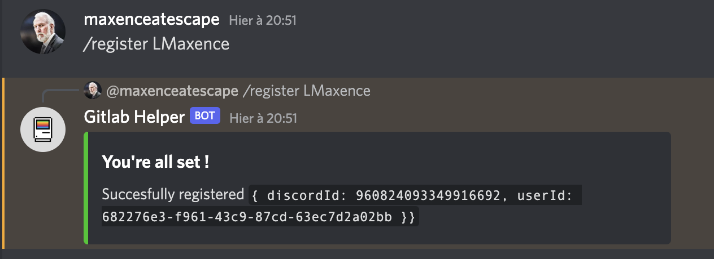
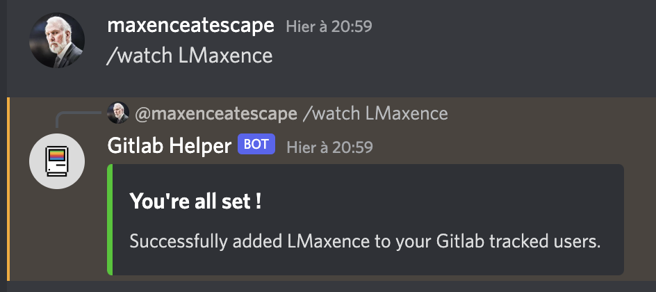
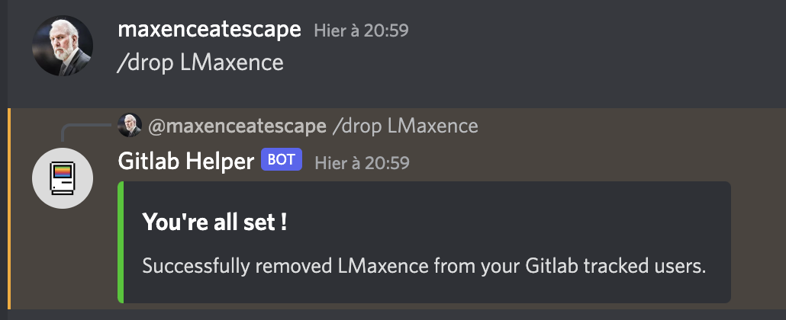
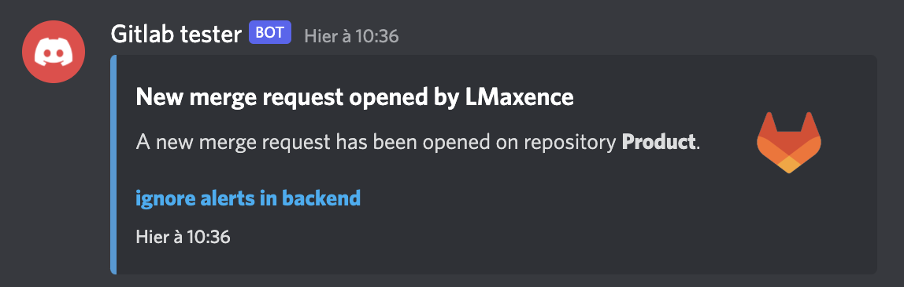
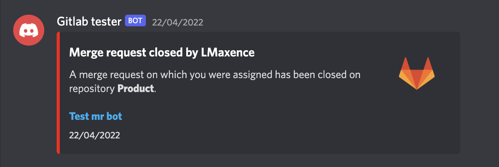
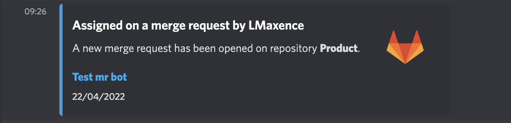
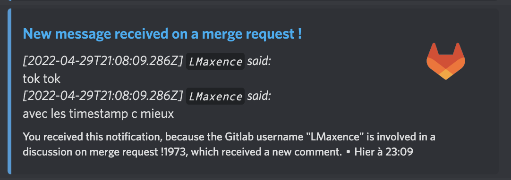

# Gitlab discord bot

A Discord bot able to track several updates (like merge requests, notes, approvals) on a Gitlab project, and send those updates to a discord channel.

It can also notify you in a private channel for updates regarding a specific user on Gitlab.

## Features

### Register to the bot and track a specific Gitlab user

You can ask the bot to send you notifications when stuff concerning a specific gitlab user happen. For instance, you can ask the bot to notify you in a private message when someone creates a merge request, or when someone answers to a merge requests openend by a specific user.

<!-- markdownlint-disable -->
*Register your gitlab Username and watch it (by default)*

*Watch a custom Gitlab username*

*Stop watching a custom Gitlab username*

<!-- markdownlint-enable -->

### Track merge requests in a common channel and in private channel

<!-- markdownlint-disable -->
*Notification for an opened merge request in a shared channel*

*Notification for a closed merge request in a shared channel*

*Notification for an assignment on a merge request*

<!-- markdownlint-enable -->

### Track notes and discussions opened on your merge requests

<!-- markdownlint-disable -->
*Notification for when a discussion is opened on your merge requests, or when a discussion you are a part of receives an answer*

<!-- markdownlint-enable -->

## Installation

This free-of-charge, open source software is provided as it is, and you are responsible for hosting it.
It requires some infrastructure to work properly, but we tried to document these requirements in the following documentation.

[See the requirements and necessary setup](./docs/requirements.md)

If you lack information on this part, please feel free to open an issue and we will be happy to provide you with the missing details :) Happy botting !
