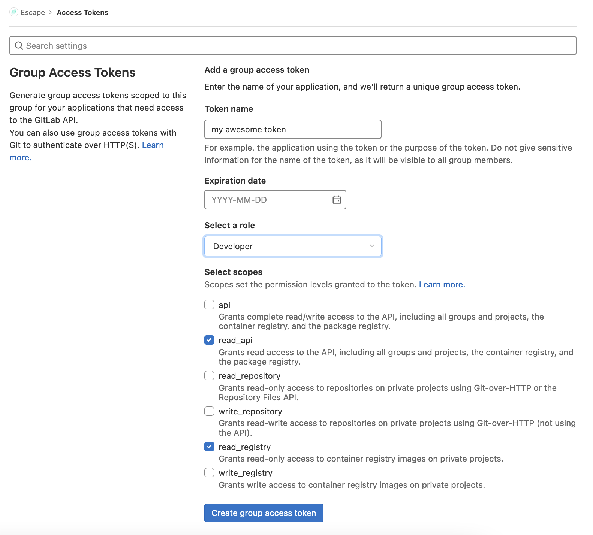
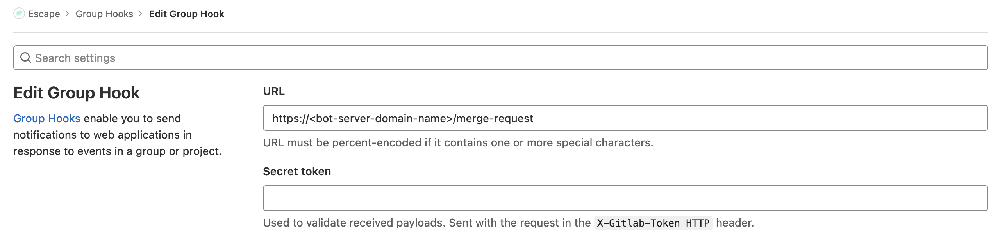
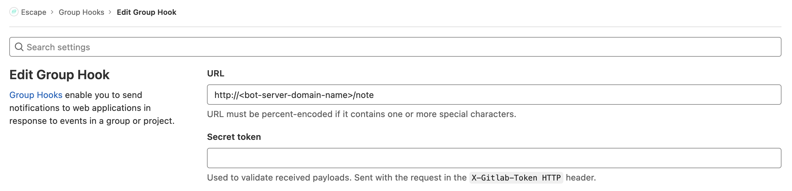

# Requirements

## Hosting

This bot is **self-managed**, this means that it is distributed as a freely-available [docker container](https://www.docker.com/resources/what-container/), that you have to run on your own server.

It also relies on a [PostgresSQL](https://www.postgresql.org/) database that needs to be self hosted as well.

## Discord application

### Retrieve your Discord client ID

In order to declare your own bot application to Discord, you need to retrieve a client ID. To do so, you need to log into the [Discord developper portal](https://discord.com/developers/applications) and create an application, as well as a bot.

### Add the bot to your Discord server

Once you have a client ID attached to your application, you can bring your own, self-hosted application to your discord server:

`https://discord.com/oauth2/authorize?client_id=<CLIENT_ID>&permissions=277025410048&scope=bot%20applications.commands`

Go to  and select the server on which you want the bot to participate, and authorize it.

**Important note on intents**
The bot needs specific intents to run, correctly, you will need to grant the following intents on this page as well:

- `Presence Intent`
- `Server Members Intent`
- `Message Content Intent`

## Gitlab Access token

Mutliple data are fetched from you Gitlab instance during the execution of the bot (for instance additional data about a merge request, or the author of a note). To enable such an access, you need to provide the bot with a valid access token.

[See the documentation on Gitlab access tokens](https://docs.gitlab.com/ee/user/project/settings/project_access_tokens.html#project-access-tokens)

The desired are scopes are the following:

- `read_api`
- `read_repository`

## Gitlab Webhooks

Among other things, The bot reacts to Gitlab webhooks. This means that you will have to setup a few webhooks on your Gitlab instance to ensure connectivity.

[See the documentation on Gitlab webhooks](https://docs.gitlab.com/ee/user/project/integrations/webhooks.html)

### Merge requests

This webhook is listened on the route `/merge-request` of the server. It requires the following trigger:

- `Merge request events`

### Notes

This webhook is listened on the route `/note` of the server. It requires the following trigger:

- `Comments`

**[Next: Configuration](./configuration.md)**

**[Go back to documentation homepage](../README.md)**
